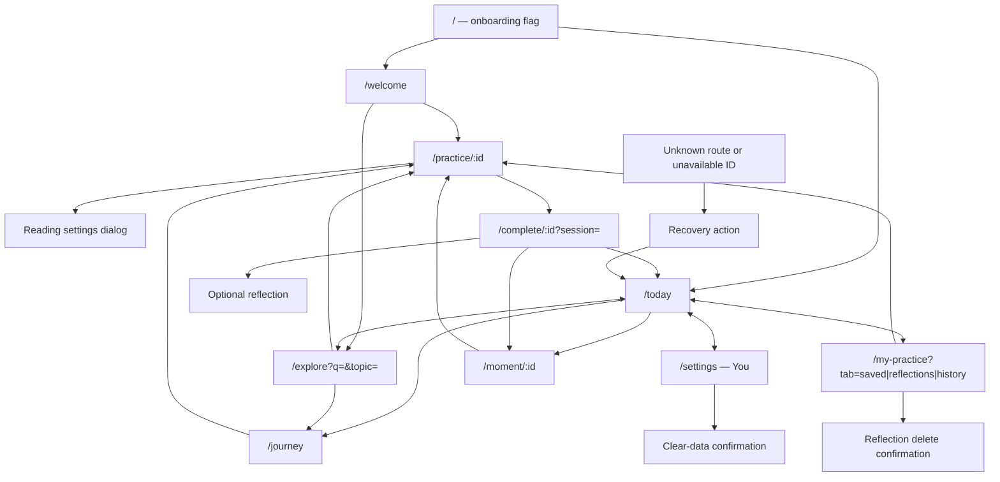

# Spritual experience audit — Phase A

24 September 2026 · Existing source, before the proposed overhaul

**Decision:** retain the working React/Capacitor foundation for the next phase; rebuild the experience incrementally behind `ui_v2`. The current product is a three-lesson, local, silent-reading demo. It is not yet the daily practice platform described in the new brief. The proposed indigo/pearl/lamplight direction should replace the current forest/ivory direction only after approval.

**Gate status:** available local audit evidence is ready for review. Native performance, real screen-reader testing, device recordings and participant usability remain unmeasured. No application source, navigation, data schema, dependency or content was changed. This report is not a claim that every Phase A measurement passed.

The owner’s [supplied brief](UX_OVERHAUL_BRIEF.md), Parts 2, 4 and 15, requires approval before visual changes. This supersedes earlier requests to continue redesigning autonomously. The previous institution-first proposals are historical; they have not been reinstated.

## 1. Stack and capabilities

| Area | Current evidence | Implication |
|---|---|---|
| Source control | Nested `app/` repository; branch main; no commits; all source untracked | No committed rollback baseline exists. Preserve current files; establish a source-only baseline before migration. Never include credentials, dependencies or private data. |
| UI | React 18.3.1 + React DOM; TypeScript 5.9.3; Vite 5.4.21, lockfile resolved versions | DOM/CSS rendering, not React Native or Flutter. New Architecture and Impeller are not applicable. |
| Navigation | React Router DOM 6.30.6, BrowserRouter | URL-based routes; current four tabs. No native shared-element or predictive-back animation engine. |
| Mobile | Capacitor core/Android/iOS 8.5.2; App 8.1.1; Share 8.0.2 | Android System WebView / iOS WKWebView. Existing lifecycle/back/share integration should survive. |
| OS floors | Android minSdk 24, target/compile 36; Swift package iOS 15 minimum | Configuration values, not proof of testing on those versions. |
| Offline | vite-plugin-pwa 0.20.5; prompt-based SW update; native bundles exclude SW | Both caches and native packaged assets require explicit version verification. |
| Motion | CSS keyframes/transitions, no motion library | Small press/page/bookmark/step effects exist. No shared elements, gesture physics, haptic vocabulary or recorded sound system. |
| Fonts | Bundled Fraunces Latin/Latin-ext; system UI and Devanagari fallbacks | No bundled Anek, Rozha One or Tiro; Hindi appearance depends on platform font availability. |
| Themes | CSS layers, partial custom properties; Paper/Evening scoped to `/practice/*` | No app-wide dark/system/sun mode. Evening is petrol, not the proposed indigo Night or Lamp. |
| Data | Versioned `spritual_demo_v1` local storage; transient reflection drafts; explicit save consent | Preserve IDs, saved progress, bookmarks, intentions, notes and settings. No connected accounts or cloud sync. |
| Backend | Supabase client dependency 2.117.0 plus SQL/contracts groundwork | Dependency and SQL presence do not prove an applied or connected backend. No Sarathi pipeline is connected. |
| Content | BG 2.47, 2.48, 6.26; original Sanskrit, IAST, unreviewed EN/HI explanations | No human audio or reviewed expanded library. Keep demo/source disclosures. |
| Tooling today | Web build and 56 tests pass. Android SDK/Java ready. No connected adb device. Full Xcode absent. | iOS simulator checks, native visual recordings and real-device performance cannot be claimed. |

**Preview mismatch found:** no live listener was found at 4173. Opening `localhost:4173/welcome` displayed an older cached “A little wisdom. A little more you.” build. Current source says “Ancient wisdom. Everyday life.” A fresh production build was served on isolated `127.0.0.1:4175`; JS `index-DqBXBew3.js`, CSS `index-C48IFQ7p.css`. All evidence below uses that current build. Existing 4173 user storage was not edited.

## 2. Screen and sheet inventory

[Open the screenshot gallery](audit/2026-09-24/index.html). It contains the complete capture inventory, with individual PNGs and DOM snapshots. [Measured bounds](audit/2026-09-24/capture-metrics.json) accompany each capture.

Normal phone: 390×844. Small phone with the app’s largest text setting: 320×568. Supplementary tablet: 768×1024; landscape: 844×390. Captures use browser CSS pixels, not native device points.

| Screen / surface | Light baseline | Largest text | Dark coverage |
|---|---|---|---|
| Welcome | `welcome-light` | `welcome-large` | Not implemented |
| Today, first/returning | `today-light` | `today-large`, `today-hindi-large` | Preference remains light: `today-evening-preference-no-dark-mode` |
| Explore / search | `explore-light` | `explore-large`, reference hit/miss | Not implemented |
| Gita journey | `journey-light` | `journey-large` | Not implemented |
| Reader: Settle, Read, Understand, Apply | Four `practice-*-light` images | Four `practice-*-large` images; Hindi reading | All four Evening stages; all four Evening/Large |
| Reading settings dialog | `reader-settings-light` | `reader-settings-large` | Evening and Evening/Large |
| Source disclosure / help toast | `source-disclosure-light`, `reader-help-toast` | Reader large baseline | Same reader theme; expanded dark disclosure not separately captured |
| Completion | `complete-light` | `complete-large` | Not implemented |
| Reflection editor / saved state | `reflection-light` | `reflection-saved-large` | Not implemented |
| Moment choices | `moment-light`; balance/attention variants | `moment-purpose-large` | Not implemented |
| My Practice: empty / saved | `my-practice-light`, `collection-saved-light` | `my-practice-large`, saved content in rhythm reproduction | Not implemented |
| My Practice: reflections/history | `collection-reflections-light`, `collection-history-light` | Matching `*-large` captures | Not implemented |
| Rhythm disclosure | `rhythm-light` | `rhythm-large`, reproduced overflow | Not implemented |
| Delete reflection confirmation | `reflection-delete-confirm-light` | Matching `*-large` | Not implemented |
| You / Settings | `settings-light` | `settings-large`, `settings-hindi-large` | Not implemented |
| Clear-data dialog | `clear-data-dialog-light` | Matching `*-large` | Not implemented |
| Missing route / lesson / moment / unearned completion | Four recovery captures | Not separately captured | Reader shell Evening possible; other dark surfaces absent |
| Offline, SW-update, unavailable storage, root crash boundary | Source inventory only in this pass | Not captured | Not implemented globally |

No fake dark screenshots were generated by injecting styles. No native screen recording was produced: no device was connected and iOS Simulator cannot run without Xcode. Browser screenshots do not prove native animation quality. Full-page captures show fixed docks at the viewport’s capture position; their overlap in a tall PNG is not, by itself, proof that scrolling content is inaccessible. Some captures include keyboard focus or a transition instant; use the DOM/bounds records for layout findings.

## 3. Navigation map and deep links

Reader, completion and moment views hide the mobile dock. The current top brand/language header remains visible. Android Back closes an open dialog first, otherwise navigates/minimizes; source-reviewed, not revalidated on a device today. Root redirects depend on the saved onboarding flag.

Preserve the existing route/query contracts and original lesson IDs during migration. The requested five-tab structure changes the meaning of Explore, My Practice and You; it needs separate approval at Phase D. Proposed mapping: Explore → Read; existing collection/progress → You; new Practice and Calendar destinations only when functional. Keep old URLs as compatible routes or redirects with query/session preservation. No native universal/app-link association was verified.

## 4. Component inventory

| Existing reusable element | Location | Migration treatment |
|---|---|---|
| Brand, LanguagePicker, Bookmark, LessonCard, WeeklyPractice | `web/src/components/Shared.tsx` | Preserve semantics and local state; migrate token consumption and typography. |
| Icon | `components/Icon.tsx` | Existing single SVG family; audit labels and extend deliberately. |
| PracticeArtwork | `components/PracticeArtwork.tsx` | Existing vector covers; no need to discard working art infrastructure. |
| JourneyCard | `components/Journey.tsx` | Actual unique completion counts; retain computed state. |
| PracticeIntention | `components/PracticeIntention.tsx` | Keep/try/response/undo behavior; preserve consent and truthful activity. |
| ReaderSettings | `components/ReaderSettings.tsx` | Native HTML dialog, focus wrap/return, pause-before-open. Candidate common Sheet foundation. |
| WebUpdates | `components/WebUpdates.tsx` | Preserve deliberate update and draft protection. |
| NativeAppExperience | `components/NativeAppExperience.tsx` | Preserve native Back/system-bar behavior; map to new themes after gate. |
| Lesson stage renderer and controls | `pages/Practice.tsx` | Extract reusable scripture block, stage navigator, reading dock; keep timing behavior. |
| Settings rows / language-size controls | `pages/Home.tsx`, ReaderSettings | Duplicate preference control patterns; share components without coupling global/reader themes. |
| Source and verse disclosures | Practice and Moment | Duplicate scripture/IAST/source display; consolidate into one content-driven block. |
| Empty/recovery panels, page headings, primary/secondary buttons | Several pages and CSS classes | Shared visual primitives currently lack a typed token/state API. |
| Toast | `App.tsx`, context | String-only success feedback; no generic action/Undo payload. |
| Reset dialog / inline delete confirmation | Home | Different interaction patterns; preserve safety and normalize focus/action layout. |
| Reflection editor | Complete | Consent-based persistence must survive any new journal design. |

Missing component families include SkyHeader, script-aware Text, HoldButton, Diya, Mala, audio player, WordChip, CalendarDay, BreathLotus and SarathiMessage. They are new capabilities, not CSS swaps. Do not expose inactive lookalike controls.

## 5. Style extraction and inconsistency

The machine-readable [style inventory](audit/2026-09-24/style-inventory.json) lists every CSS declaration with file/line, categorized values with occurrence counts, and 81 TSX candidates for inline style/icon/art values. The [readable inventory](audit/2026-09-24/STYLE_INVENTORY.md) lists the full distributions.

| Category | Unique expressions | Occurrences |
|---|---:|---:|
| Literal colors | 138 | 179 |
| Typography properties | 159 | 447 |
| Width/height/size properties | 265 | 632 |
| Spacing/position properties | 333 | 564 |
| Radius values | 31 | 92 |
| Shadows | 12 | 13 |
| Motion/transition properties | 31 | 41 |

Method: 2,399 declarations across seven CSS files. Source occurrence counts are not computed-style counts; category overlap is intentional (font-size appears in type and size), shorthand expressions are preserved, inactive/responsive rules are included. Art colors are separate TSX candidates. These counts expose extraction workload, not 138 proven visual mistakes.

Current named tokens only partially cover colors, radius and motion. Arbitrary spacing and typography remain scattered; stage/cover/collection/theme CSS adds overrides. New brief directly conflicts with current ivory/terracotta accents, all-caps tracking, middle-dot metadata, repeated arrows, highlighted headline word and repeated card entrance effects. The Welcome arch frames landscape art instead of scripture. Fraunces plus system fonts does not satisfy the requested script-aware type system.

## 6. Heuristic evaluation

Expert review, not participant research. Numbers are the worst observed issue severity for each heuristic: **0** no issue identified in the inspected state; **1** cosmetic; **2** minor friction; **3** major obstruction/gap; **4** critical. A zero does not certify the whole heuristic. H1 status; H2 real-world match; H3 control/undo; H4 consistency; H5 error prevention; H6 recognition; H7 efficiency; H8 restraint; H9 recovery; H10 help.

| Surface | H1 | H2 | H3 | H4 | H5 | H6 | H7 | H8 | H9 | H10 |
|---|---:|---:|---:|---:|---:|---:|---:|---:|---:|---:|
| Welcome | 0 | 1 | 0 | 2 | 0 | 1 | 2 | 2 | 0 | 1 |
| Today | 1 | 2 | 0 | 2 | 0 | 2 | 3 | 2 | 0 | 1 |
| Explore/search | 0 | 2 | 0 | 2 | 2 | 2 | 3 | 2 | 1 | 1 |
| Journey | 0 | 1 | 0 | 2 | 0 | 1 | 2 | 2 | 0 | 1 |
| Reader | 1 | 2 | 1 | 2 | 1 | 2 | 3 | 2 | 1 | 1 |
| Reading settings | 0 | 0 | 0 | 2 | 0 | 1 | 2 | 2 | 0 | 1 |
| Complete/reflection | 0 | 1 | 2 | 2 | 0 | 1 | 2 | 2 | 1 | 1 |
| Moment | 0 | 1 | 1 | 2 | 0 | 1 | 2 | 2 | 0 | 1 |
| My Practice/rhythm | 0 | 2 | 2 | 2 | 0 | 2 | 3 | 2 | 1 | 1 |
| Settings/reset | 0 | 2 | 1 | 2 | 0 | 2 | 3 | 2 | 0 | 1 |
| Missing-content recovery | 0 | 0 | 0 | 1 | 0 | 0 | 1 | 1 | 0 | 0 |

### Issue register

| ID | Severity | Finding / evidence | Proposed resolution and phase |
|---|---:|---|---|
| A01 | 3 | 320px/Large: opening rhythm expands document to **363px**. Reproduced twice; `.practice-rhythm` width 347px, min-content pressure from weekly/routine contents. | Fix wrapping/min-width and week layout in foundations/components; retain actual activity semantics. |
| A02 | 3 | Global dark mode absent. Reader Evening exits to a light Today/completion/settings. | Semantic theme engine and system setting in B; all screens later migrate. |
| A03 | 3 | “bg 2 47” returns zero results; “2.47” finds the existing verse. | Reference parser with canonical IDs in F; preserve URL query/filter state. |
| A04 | 3 | No audio, japa, Sarathi, calendar or actual reminders: five of eight requested journeys cannot complete. | New scoped features with content/backend requirements; do not label them existing regressions. |
| A05 | 3 | Largest built-in text is **19/16 = 118.75%**, not 200%; Indic faces are system-dependent. | B text primitives and scaling; C/I native overflow and screen-reader checks. |
| A06 | 2 | Current brand header link ~39px high on phone, below requested 44/48 minimum. | Expand hit box in C; retain compact visual mark. |
| A07 | 2 | Reader includes global language header, stage headings, timer, silent note and help. Verse is separated from explanation by a stage change; timer is prominent despite no audio. | E verse-first hierarchy, optional utilities in sheet. Preserve the current silent/manual route. |
| A08 | 2 | Sanskrit uses system serif and normal wrapping; source verse number stays in body size. No explicit pada/number typesetting, word chips or font guarantee. | B scripture Text; E typesetting driven by source data. Never invent segmentation/glosses. |
| A09 | 2 | Bookmark toggle can reverse removal while visible but has no action-toast Undo; saved-card removal can move the item away. Reflection deletion warns but cannot be undone. | C accessible action toast; F reversible deletion with approved data model. |
| A10 | 2 | My Practice sounds like a practice launcher but opens saved collection; You opens preferences rather than personal practice. | D owner-approved IA migration and aliases. |
| A11 | 2 | Welcome heading emphasis, repeated caps/arrows/dots, art arch and forest/ivory palette conflict with the supplied visual direction. | B/C new tokens; E/F page migration. |
| A12 | 2 | Large art and introductory material push Today choices/search down; Explore repeats “The reading room” and has an expansive planned-catalog block. | E/F hierarchy reduction; retain honest planned-content distinction. |
| A13 | 2 | Generic page/card entrances rerun on navigation; no shared-element continuity or gesture-scrubbable back transition. | D motion prototype and native feasibility gate before promising parity. |
| A14 | 2 | Stale cached preview presented an earlier design while no server listened at 4173. | Preview/build identity in QA workflow; verify update prompts and cached navigation in I. |
| A15 | 2 | Unreviewed teaching; expanded catalog/audio absent. External source link is not reviewer approval or recording rights. | Content review/rights track before public content launch. |
| A16 | 1 | Brand, headings and bilingual line metrics vary through system fallbacks; subtle source/metadata hierarchy is inconsistent. | Bundle audited font subsets, script-aware styles in B. |

No severity-4 defect was established in existing working reading behavior. The specified future AI pipeline has design risks listed in section 11; no active AI service was tested.

## 7. Friction log: eight required journeys

These are agent walkthroughs. Tap counts exclude typing, scrolling and inspection actions. Times are **not measured human usability times**. Do not turn tool execution speed into a first-user metric.

| Journey | Observed path and result | Hesitation / dead end | Baseline |
|---|---|---|---|
| Install → first practice | Browser Welcome → Start with the Gita → Read → Understand → Apply → Finish. Completion and explicit reflection saving worked. | Initial Settle screen is not scripture. Optional timer suggests playback but is clearly labeled as a timer. No diya ceremony. Native install not repeated. | 1 tap to session; 5 taps from Welcome to finish. <3 min human target unmeasured. |
| Read today’s verse and hear it | Today → Begin lesson → Read for a fresh lesson. | Human audio explicitly absent; there is no recitation play button. | 2 taps to fresh verse; hear task blocked. |
| Start/finish one mala | Today and My Practice inspected. | No Japa destination or counter. | Cannot complete; no invented tap count. |
| Find a specific verse | Today → Explore → Search → type `2.47` → lesson title. | `bg 2 47` fails; recovery “Show all lessons” works. Read stage may require another tap. | 3 taps plus typing to lesson; <15s target unmeasured. |
| Ask about a verse | All reader controls inspected. | No Ask/Sarathi. | Cannot complete. |
| Change reminder | Today → You and My Practice → rhythm. | Rhythm is a preference only; explicitly sends no notifications. No time picker/OS reminder permission. | Cannot complete reminder task. |
| Today’s panchang / festival | Current tab map and routes inspected. | No Calendar, location, ephemeris or festival source. | Cannot complete. |
| Return after missing 3 days | Same-session reload/navigation preserves data; source/test review shows resume priority and non-punitive weekly activity. | No actual three-day lapse was simulated or observed. No lost-streak messaging in existing UI. | Return works in immediate test; 3-day experiment pending. |

Additional checks: bookmark save; one actual test completion; reflection opt-in/save; delete/reset cancellation; history and collection URL state; reduced-motion selection; unknown route/content recovery. Synthetic entries exist only on 4175. No real reflection was deleted and no message was sent externally.

## 8. Performance baseline

| Measure | Evidence | Status |
|---|---|---|
| Production build | TypeScript + Vite + PWA generation passed | Verified |
| Main JS | 279.42 KB, **93.90 KB gzip** | Build report |
| CSS | 69.60 KB, **14.50 KB gzip** | Build report |
| PWA precache | 739.57 KiB uncompressed | Build report |
| Main artwork | Bundled WebP; no runtime remote font dependency | Source/bundle inspected |
| Browser console | No warning/error returned by captured tab log query during walkthrough | Limited to tool-captured log history |
| Cold start / TTI | Not measured; DOM inspection tool does not expose browser Performance entries | Open gate; no <2s claim |
| Scroll/transition FPS | Not measured on real or low-end Android | Open gate; no 60/120fps claim |
| JS/UI stalls, native memory, GPU time | No profiler capture | Open gate |
| Haptic/audio latency | Not implemented | Not applicable to current demo |

Required baseline protocol before E/H acceptance: dedicated budget Android and high-refresh phone; record device, OS, WebView version and refresh rate; 10 force-stop launches (exclude installation/first content download separately); median/p95 visible interactive Today; Perfetto/Android Studio capture for a scripted scroll and every transition; memory before/after 10 practice loops; interruptions/background/low-power conditions. Use physical-device evidence for haptics/audio. iOS requires full Xcode and a test device/simulator; simulator results must remain labeled.

## 9. Accessibility baseline

- **Verified:** all standard tested primary layouts stayed within viewport; the expanded rhythm exception is A01. Reader stage buttons expose numbered names; current step uses `aria-current`. Language controls expose pressed state. Reader settings has a labeled dialog, close/Done controls, focus wrap and return in source. Reflection and reset cancellations were exercised. Source Sanskrit uses language-tagged markup; actual assistive pronunciation is unverified.
- **Contrast screening:** [results](audit/2026-09-24/contrast-screening.json) found no below-AA pairs among inspected text leaves over fully opaque solid backgrounds in nine screen contexts. This excludes image backgrounds, transparency/opacity, non-text controls, focus rings, disabled states and uninspected states. It is **not** a complete WCAG pass. Prior screenshots caught animation instants; opacity cases were deliberately excluded.
- **Touch targets:** measured brand link about 39px high. Raw radios/checkboxes also appeared under 44px, but their enclosing clickable labels are larger; raw-input size alone is not a confirmed target failure. Expanded hit-target audit is needed for 48px Android/56px Elder requirements.
- **Large text:** observed root size 19px versus default 16px. Most 320px pages reflow; rhythm fails. This does not satisfy native 200% Dynamic Type testing. English and Hindi selected screens were captured; no South Indian language exists in the current UI.
- **Reduced motion:** after choosing Reduce motion, Today page/feature/moment computed animations were `none`; persisted setting is covered by tests. OS-level reduced transparency, bold text, grayscale and low-power behavior were not exercised.
- **Screen readers:** DOM/accessibility labels inspected; no full VoiceOver or TalkBack journey was performed. This gate remains open.
- **Absent:** Elder mode, Kids mode, recorded audio transcripts/captions, accessible mala/HoldButton actions. No claims of cultural or native-speaker review.

Do not shrink user-requested 200% text to a 20pt floor just to preserve verse geometry. Proposed priority: accessible scale and full content, then source-aware line breaks and continuation indent. The brief’s suggested shrink-to-fit needs this clarification in B.

## 10. Gap analysis against every part

| Brief part | Status | Concrete gap / preserved foundation |
|---|---|---|
| 0 Context | Partial | Phone-ready DOM + Android wrapper; EN/HI demo only; iOS unbuilt. |
| 1 Quality bar | Unproven | No participant preference/SUS/three-minute validation. |
| 2 Overhaul rules | Phase A applied | No `ui_v2` yet; no committed baseline; docs created; no app edits. |
| 3 Principles / targets | Partial | Plain actions, local privacy and no guilt exist; audio/japa/Ask targets impossible today. |
| 4 Audit | Available evidence delivered | Native recordings/performance and actual screen-reader measurements unavailable. |
| 5 Spatial model / IA | Missing proposed model | Four current tabs; no sheets/gesture transition system beyond reader dialog. |
| 6 Visual language | Major replacement | Palette, fonts, scripture typesetting, global themes, sky and icon direction differ. |
| 7 Components | Partial foundation | Existing small component set; most practice/audio/calendar/AI families absent. |
| 8 Screens | Reading demo only | Nine page exports plus recoveries; auth/japa/calendar/paywall/widgets absent. |
| 9 Motion | Partial | CSS feedback/reduced-motion support; no physics, shared elements, ceremony catalog or real-device profiles. |
| 10 Haptics/sound | Absent | No recorded UI sounds, haptic vocabulary or sound/haptic settings. |
| 11 AI | Absent | No endpoint, retrieval corpus, safety/eval suite, streamed UI or AI data retention implementation. |
| 12 Microcopy | Partial | Bilingual plain text and truthful demos; many all-caps/dots and repeated prompts; no native-speaker review evidence. |
| 13 Inclusion | Partial | Basic reflow/labels; A01; 200%, Elder/Kids and broader script coverage absent. |
| 14 Usability proof | Not performed | Existing USER_TEST_PLAN is a protocol, not research results. No participants contacted. |
| 15 Execution | At approval gate A | B–I have not started under this new brief. |
| 16 Definition of best | Not met | Working demo behavior is not evidence of all product, motion, AI and usability targets. |
| 17 Craft intent | Direction accepted for proposal | Acceptance must be tied to observable tasks, performance and review, not “best” claims. |

## 11. Migration plan, risks and estimates

Estimates are engineering person-days for one experienced implementer with timely decisions and ready assets; **planning ranges, not commitments**. Content licensing/recording/review, real participants, provider accounts and physical hardware can add calendar time. No paid provider or new repository is required for Phase B.

| Phase | Increment | Estimate | Gate / dependency |
|---|---|---:|---|
| B | Snapshot current source; `ui_v2` off by default; semantic tokens; bundled audited font subsets; Text; app themes; isolated sky/type playground | 3–5 | Review playground first. Keep current screens and storage unchanged. Existing stack is proposed, not an approved native replatform. |
| C | Buttons, actionable toast, sheet, segmented controls, scripture block, accessible focus/targets; fix A01 in new path | 4–7 | State matrix in two themes/large text/reduced motion. |
| D | Approved five-tab mapping, old URL compatibility, back behavior, keyboard and transition prototype | 3–5 | Owner approves IA. Prove native gesture feasibility before committing to shared-element parity. |
| E | Today, verse view and persisted Japa vertical slice | 6–10 | Licensed/reviewed content where used; native kill/interruption/rapid-count tests; first real usability round. |
| F | Remaining actual library/practice/account/calendar/reminder surfaces, offline/error states | 12–20 | Scope and provider approval. Calendar needs validated location/timezone/tradition source. Audio needs rights and timestamps. Payments require a separate commercial decision. |
| G | Server-only AI pipeline, validated streaming, reviewed corpus, ≥300 eval prompts, bounded Sarathi UI | 10–18 | Provider/cost/retention approval; evals before AI UI signoff. No fake success for missing corpus or credentials. |
| H | Diya, mala, sensory synchronization, restrained earned motion and interruption handling | 5–8 | Recorded/licensed sounds, actual haptic hardware, native recordings/profiles. |
| I | 200%, assistive-tech, multilingual/Elder/Kids, performance, second usability round, remove flag only after parity | 6–10 | Real participants, native devices and all critical/major issues resolved. |

**Total provisional B–I:** 49–83 person-days, excluding external production/review. Phase F’s broad feature list and child/account/payment requirements can expand it substantially. Do not bill this as a one-pass cosmetic refresh.

### Data and rollback contract

Keep old IDs and versioned storage intact. New fields must be optional and backward-readable while the flag exists. Snapshot only test fixtures for regression tests; never upload user reflections. Test old-state → v2 → rollback round trips, unknown IDs, cross-tab conflicts and interrupted writes. Current draft text remains transient unless the owner approves changed autosave consent. Do not reinterpret historical lesson completions as Japa counts, a lit diya or retrospective streaks. No existing feature has been approved for removal.

### Required brief corrections / explicit decisions

1. **Scope and stack:** retain React/Vite/Capacitor for B; perform a gesture/performance feasibility spike in D. Native replatforming would need approval and a separate estimate.
2. **AI Hindi conflict:** Parts 11.6/11.8 prohibit all Devanagari while 11.7 asks for the user’s language. Proposed correction: Hindi explanatory prose is allowed; canonical scripture is rendered only from verified IDs. Validate quotations/citations by content role, not Unicode range.
3. **AI streaming conflict:** final validation after displaying deltas can expose unsupported material before rejecting it. Proposed correction: validate buffered claim/citation segments before display, and complete crisis pre-check before any answer text. Consider fully buffered answers for initial release.
4. **Safety meaning:** retrieved citation IDs being valid is not proof that the explanation is supported. Evals need claim support, multilingual crisis coverage and human content review. Crisis response must not depend on the answer model eventually emitting META.
5. **Habit model:** brief adds streaks, grace days and missed-day dimming; current product deliberately avoids punitive counters. Proposed default: preserve non-punitive activity and explicit completions until the owner chooses the new habit model; no retroactive fabricated history.
6. **Sky/calendar:** no location or religious calendar source is selected. Manual-city fallback and clearly labeled illustrative sky in playground; do not present sample tithi/sunrise/festival values as current facts. Verify astronomical/calendar rules and licensing before implementation.
7. **Audio:** human recordings and word timing are unavailable. Hide play where missing; do not use synthesized Sanskrit or false karaoke. The silent experience remains useful and complete.
8. **Consent:** existing explicit reflection save stays; AI reflection consent is per use. Analytics/crash reporting are proposals needing a defined privacy contract, not permission to send raw notes or faith activity.
9. **Kids/access:** parental gates, child data, authentication and billing are new product decisions. No new paywall/account or child mode is implied by approving foundations.
10. **Text and onboarding:** preserve accessible text scale rather than shrink-to-fit. Auto-advance and hold gestures require visible/assistive alternatives and must pass usability tests; do not make them prerequisites for completing the current demo.

## 12. Owner approval

**Approve this audit and Phase B only: retain the existing stack, introduce the proposed indigo/pearl/marigold design foundations behind an off-by-default `ui_v2` flag, and keep current navigation, content and saved data intact?**

This approval would authorize foundations/playground work only. The five-tab navigation, streak semantics, new providers, AI data handling, payments and later phase gates remain explicit decisions. Native/participant evidence gaps above remain open rather than being marked passed.

### Evidence index

- [Full supplied brief](UX_OVERHAUL_BRIEF.md)
- [Screenshot gallery](audit/2026-09-24/index.html)
- [Bounds and touch-target candidate measurements](audit/2026-09-24/capture-metrics.json)
- [Contrast-screening method and results](audit/2026-09-24/contrast-screening.json)
- [Every extracted CSS value/count](audit/2026-09-24/STYLE_INVENTORY.md)
- [Source hashes](audit/2026-09-24/source-hashes.json)
- [Existing participant protocol](USER_TEST_PLAN.md), not completed research
- [Progress](PROGRESS.md), [decisions](DECISIONS.md), [deferred/gate register](DEFERRED.md)
